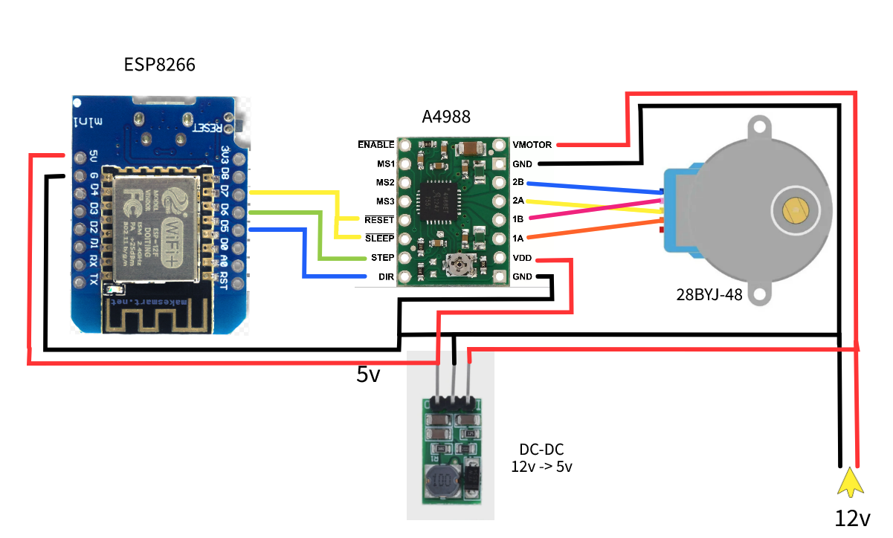
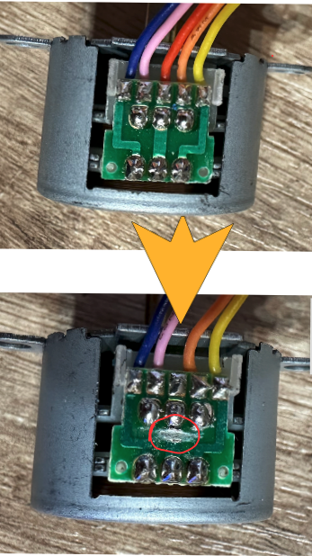

# Blind ESPHome

Автоматические шторы с использованием шаговика 28BYJ-48 на 12V с драйвером A4988 и прошивкой на ESPHome. В прошивке реализованно позиционное управление шторами и настройка начальных положений. Координата положения записывается в сохраняемую переменную (раз в 30сек) и состояние восстанавливается в случае перезагрузки.

Для подключения 28BYJ-48 на 12V к драйверу A4988, необходимо доработать 28BYJ-48, инструкция как ниже. Используется данный вариант так как он существенно сильнее чем использование 28BYJ-48 5V с драйвером ULN2003.

В папке 2 файла прошивки:
- [bling-nightday.yaml](/blind/bling-nightday.yaml) - шторы ДеньНочь, реализован дополнительный ползунок для положений.
- [blind-window.yaml](/blind/blind-window.yaml) - просто шторы.

Необходимо:
1. ESP8266
2. Driver A4988
3. Stepper 28BYJ-48 12V
4. Понижающий DC-DC 12v-5v. [Пример](https://aliexpress.ru/item/1005001597589461.html)

## Инструкция.
1. Соединяем все по схеме выше
2. Заполняем в файле прошивки переменные:
    - **device_name** - имя устройство на англ, между словами использовать "-"
    - **entity_name** - такое же, как device_name, но между словами использовать "_"
    - **entity_friendly_name** - такое же, как device_name, возможны пробелы
    - **device_name_wifi** - Наименование WiFi captive_portal для настройки
    - **device_class_cover** - класс устройства, например "shade". [Все варианты](https://www.home-assistant.io/
    - **ota_password** - пароль ota
    - **wifi_ssid** - сеть wifi для подключения
    - **wifi_pass** - пароль от сети wifi
    - **api_key_tok** - токен для шифрованного соединения с Home Assistantintegrations/cover/)
3. Загружаем прошивку, устанавливаем на место и приступаем к настройке нижней и верхней позиции
4. Дополнительно доступен объект Speed Stepper (скрыт по умолчанию) для настройки скорости, от 100 до 650 и по умолчанию 600. При настройке позиций скорость будет в полтора раза меньше для более точной позиции.

### Настройка позиций.

1. Включить тумблер Setup, это включит режим настройки позиций.
2. Нажимаем на кнопку Next Setup, шторы должны начать закрываться, если шторы начали открываться, то включаем тумблер Invert Position Setup (скрыт по умолчанию), настройка начнется заново в другую сторону.
3. Ожидаем пока дойдет до максимальной крайней точки в закрытом положении и нажимаем еще раз на кнопку Next Setup.
4. Шторы должны начать открываться. Ожидаем пока дойдет до максимальной крайней точки в открытом положении и нажимаем еще раз на кнопку Next Setup.
5. Настройка положений закончена.

*Invert Position Setup необходим только в момент настройки верного хода, в дальнейшем в работе никак не влияет его положение.*

### Доработка шаговика.

Для работы 28BYJ-48 на 12V с A4988, необходимо отпаять красный провод и перерезать дорожку от него соединяющие 2 контакта.

