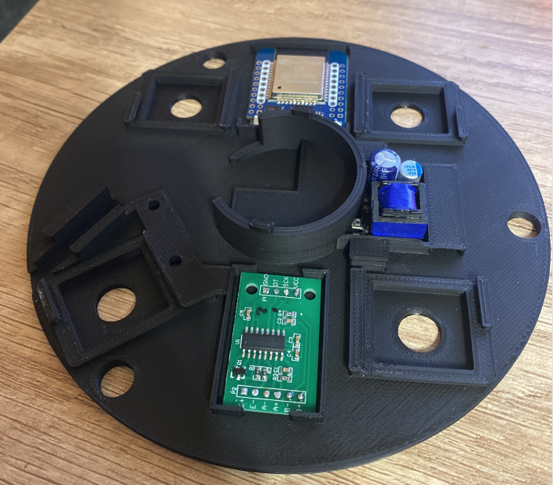
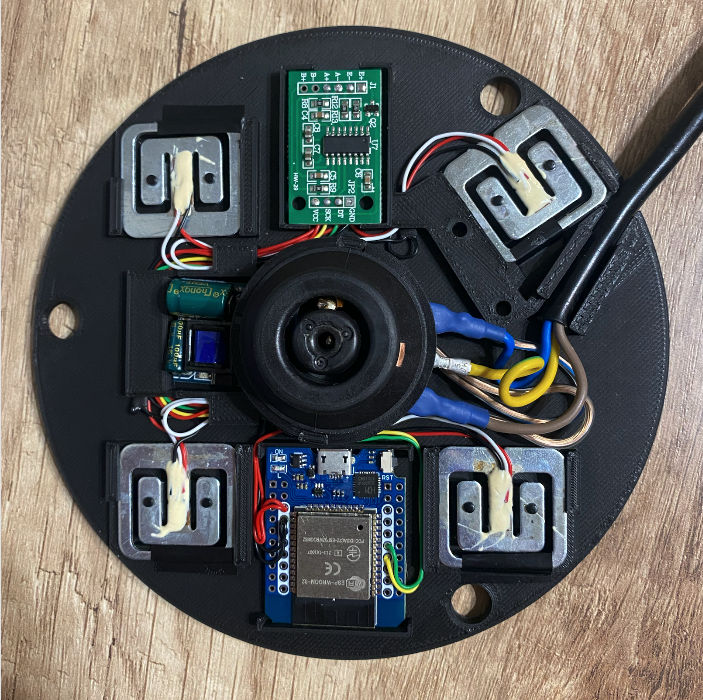
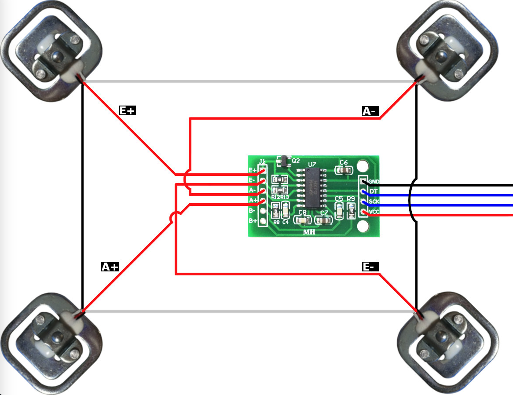

# Подставка с весами для чайника Redmond RK-G210S на ESPHome с компонентом Ready4Sky.

Подставка необходима для добавления датчиков весов и определения количества воды в чайнике. Так же используется компонент [Ready4Sky skykettle](https://github.com/KomX/ESPHome-Ready4Sky/tree/main/components/skykettle) для управления чайником по bluetooth в Home Assistant.

В модели используются тензодатчики из [данных весов](https://www.wildberries.ru/catalog/74249901/detail.aspx) , по этому модель необходимо поправить для использования [таких](https://aliexpress.ru/item/1005001853993037.html?sku_id=12000017862724242&spm=a2g2w.productlist.search_results.5.7e8d4aa61sWSqP). 
После установки необходимо откалибровть тензодатчики разным весом и указать в фильте sensor_hx711_d

